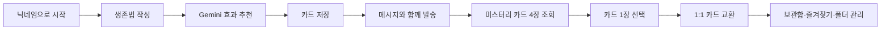
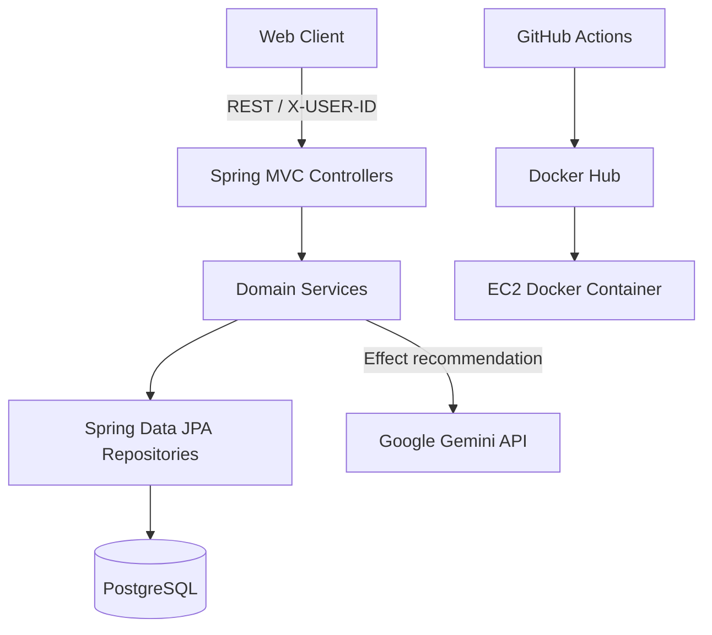
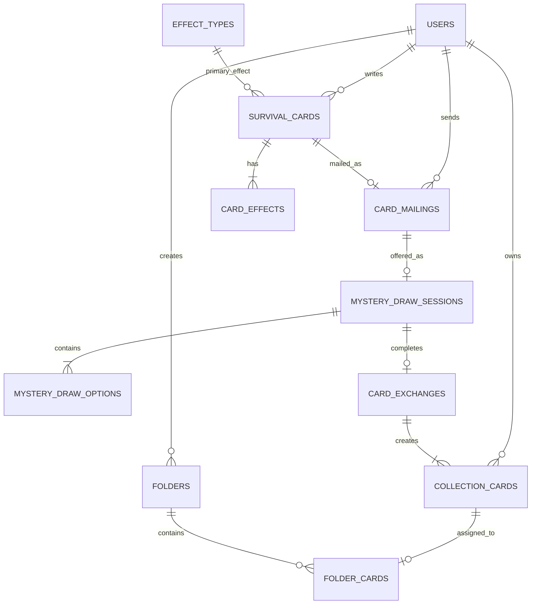

# KUIT Hackathon 2026 Backend

> 나만의 여름 생존법을 카드로 만들고, AI 추천 효과를 적용한 뒤 다른 사용자와 익명으로 교환하는 서비스의 백엔드입니다.

[](https://openjdk.org/)
[](https://spring.io/projects/spring-boot)
[](https://www.postgresql.org/)
[](https://www.docker.com/)

## 프로젝트 소개

사용자는 자신만의 여름 생존법을 카드로 작성하고, Gemini가 추천한 효과와 레벨을 참고해 카드를 완성할 수 있습니다. 완성한 카드는 메시지와 함께 교환 풀에 보내며, 미스터리 카드 네 장 중 하나를 선택해 다른 사용자의 카드와 1:1로 교환합니다. 생성하거나 받은 카드는 보관함에서 즐겨찾기, 메모, 사용자 지정 폴더로 관리할 수 있습니다.

### 핵심 기능

| 영역 | 기능 |
|---|---|
| 사용자 | 닉네임 중복 확인, 사용자 생성, 내 정보 및 홈 요약 조회 |
| AI 추천 | 제목·설명·추천 상황을 기반으로 Gemini가 5개 효과 점수와 상위 효과를 추천 |
| 생존 카드 | 카드와 1~3개의 효과를 원자적으로 생성하고 보관함에 저장 |
| 카드 발송 | 미발송 카드를 메시지와 함께 교환 풀에 등록하고 미스터리 후보 4개 생성 |
| 미스터리 교환 | 후보 조회, 카드 선택, 양쪽 우편 상태 변경과 1:1 교환 확정 |
| 보관함 | 만든 카드와 받은 카드 조회, 효과 필터, 즐겨찾기, 메모, 삭제 |
| 폴더 | 사용자 폴더 생성·수정·삭제 및 카드 이동·제거 |

이미지 기능은 서비스 범위 조정에 따라 기본적으로 비활성화되어 있으며 Swagger에서도 숨겨져 있습니다.

## 사용자 흐름



## 시스템 구성



서비스는 도메인별 Controller–Service–Repository 구조를 사용합니다. 조회 서비스는 기본적으로 `@Transactional(readOnly = true)`를 사용하고, 상태를 변경하는 유스케이스만 쓰기 트랜잭션으로 재정의합니다.

```text
src/main/java/com/example/hackathon
├── domain
│   ├── user
│   ├── effect
│   ├── recommendation
│   ├── card
│   ├── mailing
│   ├── draw
│   ├── exchange
│   ├── collection
│   ├── folder
│   └── image
└── global
    ├── config
    ├── exception
    └── storage
```

## 기술 스택

| 분류 | 기술 |
|---|---|
| Language | Java 21 |
| Framework | Spring Boot 4.1.0, Spring MVC |
| Persistence | Spring Data JPA, Hibernate |
| Database | PostgreSQL, H2(Test) |
| External API | Google Gemini API, Spring `RestClient` |
| API 문서 | Springdoc OpenAPI 3.0.3, Swagger UI |
| Build | Gradle 9.5.1 |
| Test | JUnit 5, AssertJ, Spring Boot Test |
| Infra | Docker, Docker Hub, AWS EC2, GitHub Actions |

## API 문서

배포 서버 기준 주소입니다.

| 구분 | 주소 |
|---|---|
| Base URL | `http://13.209.66.10:8080` |
| Swagger UI | `http://13.209.66.10:8080/swagger-ui/index.html` |
| OpenAPI JSON | `http://13.209.66.10:8080/v3/api-docs` |

사용자별 API는 MVP 인증 방식으로 `X-USER-ID` 헤더를 사용합니다.

```http
X-USER-ID: 1
Content-Type: application/json
```

### API 요약

| 도메인 | Method | Endpoint | 설명 |
|---|---|---|---|
| Users | `POST` | `/api/users` | 사용자 생성 |
| Users | `GET` | `/api/users/nickname/check` | 닉네임 중복 확인 |
| Users | `GET` | `/api/users/me`, `/api/users/me/home` | 내 정보 및 홈 요약 |
| Effects | `GET` | `/api/effect-types` | 효과 타입 조회 |
| AI | `POST` | `/api/effect-recommendations` | Gemini 기반 효과 추천 |
| Cards | `POST` | `/api/survival-cards` | 생존 카드 저장 |
| Cards | `GET` | `/api/survival-cards/me`, `/api/survival-cards/{cardId}` | 카드 조회 |
| Mailings | `POST` | `/api/card-mailings` | 카드를 교환 풀에 발송 |
| Mailings | `GET` | `/api/card-mailings/me` | 내 발송 우편 조회 |
| Mystery | `GET` | `/api/mystery-draws/{mysteryDrawId}` | 미스터리 후보 조회 |
| Mystery | `POST` | `/api/mystery-draws/{mysteryDrawId}/select` | 카드 선택 및 교환 확정 |
| Exchange | `GET` | `/api/card-exchange/{exchangeId}` | 교환 결과 조회 |
| Collection | `GET/PATCH/DELETE` | `/api/collection-cards/**` | 보관함 조회 및 관리 |
| Folders | `GET/POST/PATCH/DELETE` | `/api/folders/**` | 폴더 및 폴더 카드 관리 |

요청·응답 DTO와 전체 27개 API 명세는 [API_LIST.md](./API_LIST.md)에서 확인할 수 있습니다.

## 데이터 모델

주요 엔티티 관계는 다음과 같습니다.



### 보관함과 폴더의 기준

- `collection_cards`는 사용자가 실제로 보유한 카드입니다.
- `folders`는 사용자가 만든 폴더의 이름과 색상을 저장합니다.
- `folder_cards`는 보유 카드와 사용자 폴더를 연결합니다.
- `전체`, `기본`, `받은 카드`, `즐겨찾기`는 실제 폴더 row가 아니라 컬렉션 조회 필터입니다.
- `folder_cards.collection_card_id`는 unique이므로 카드 한 장은 사용자 지정 폴더 하나에만 속합니다.

전체 DBML과 제약조건은 [ERD_CURRENT.md](./ERD_CURRENT.md), 유스케이스별 서비스 흐름은 [DOMAIN_SERVICE_FLOW.md](./DOMAIN_SERVICE_FLOW.md)를 참고하세요.

## 기술적 고민과 해결

### 1. Gemini 연동 오류가 전체 API의 500으로 번지던 문제

#### 문제

Gemini 연동 초기에는 외부 API의 HTTP 오류, 네트워크 단절, 10초 타임아웃, 비정형 응답이 추천 API 밖으로 전파됐습니다. 그 결과 핵심 기능이 아닌 AI 추천 실패 때문에 카드 작성 흐름 전체가 500 계열 오류로 중단됐고, 외부 서비스 상태에 우리 API 가용성이 종속됐습니다.

#### 판단

AI 추천은 사용자의 입력을 돕는 보조 기능이며 카드 생성의 필수 데이터가 아닙니다. 따라서 일시적인 외부 장애는 사용자 요청 실패가 아니라 결정적인 기본값으로 흡수하는 것이 서비스 목적에 더 적합하다고 판단했습니다. 반면 API Key 자체가 없는 경우는 배포 설정 오류이므로 조용히 숨기지 않고 `503 Service Unavailable`로 구분했습니다.

#### 해결

1. `RestClient`에 연결·읽기 타임아웃을 기본 10초로 설정했습니다.
2. `RestClientResponseException`과 `RestClientException`을 분리해 처리했습니다.
3. 외부 오류 상태와 최대 2,000자의 응답 본문을 WARN 로그로 남기고 빈 점수로 전환했습니다.
4. 누락되거나 범위를 벗어난 점수는 서비스 계층에서 1~5로 정규화했습니다.
5. 점수가 없으면 모든 효과에 기본 점수 2를 적용하고 `displayOrder`로 정렬합니다. 따라서 기본 추천은 `COOLING`, `MENTAL`, `STAMINA` 순으로 결정됩니다.
6. Gemini 응답은 JSON 객체에서 허용된 효과 코드와 `score`만 파싱하여 불필요한 형식 변동의 영향을 줄였습니다.

#### 결과

Gemini의 HTTP 오류·타임아웃·네트워크 오류가 발생해도 추천 API는 일관된 기본 결과를 반환합니다. 외부 장애가 카드 작성 흐름을 중단하지 않으며, HTTP 오류와 요청 단계 오류 각각을 테스트로 고정했습니다.

### 2. 동시 요청에서 중복 교환과 폴더 이동 500을 막는 방법

#### 문제

트랜잭션만 선언하면 여러 요청이 순차 실행될 것이라고 생각하기 쉽지만, 서로 다른 트랜잭션은 같은 `OPEN` 또는 `WAITING` 상태를 동시에 읽을 수 있습니다.

- 같은 미스터리 드로우를 동시에 선택하면 양쪽 요청이 모두 교환 가능하다고 판단할 수 있었습니다.
- 같은 보관 카드를 동시에 서로 다른 폴더로 이동하면 `delete → flush → insert`가 교차하면서 `folder_cards.collection_card_id` unique 제약 위반과 500이 발생할 수 있었습니다.
- 애플리케이션의 `synchronized`는 서버 인스턴스가 여러 개일 때 동시성을 보장하지 못합니다.

#### 판단

충돌 빈도는 낮지만 한 번의 중복 교환도 데이터 정합성을 훼손하며, 경합 대상 row가 명확했습니다. 재시도가 필요한 낙관적 락보다 DB가 임계 구역을 직렬화하는 비관적 쓰기 락이 현재 트래픽과 구현 복잡도에 적합하다고 판단했습니다.

#### 해결

1. 미스터리 선택 시 `MysteryDrawSession`을 `PESSIMISTIC_WRITE`로 먼저 잠급니다.
2. 교환에 참여하는 두 `CardMailing` ID를 오름차순 정렬한 뒤 같은 순서로 잠가 교착 가능성을 줄였습니다.
3. 세션 상태 확인, 우편 상태 변경, 교환 생성, 양쪽 `CollectionCard` 생성을 하나의 쓰기 트랜잭션에서 처리합니다.
4. 폴더 이동·제거와 보관 카드 수정 시 `CollectionCard` row를 `PESSIMISTIC_WRITE`로 잠급니다.
5. 락을 획득한 뒤 기존 `FolderCard`를 삭제하고 `flush()`한 다음 새 연결을 저장해 unique 제약과 작업 순서를 일치시켰습니다.
6. DB unique 제약은 락 이후에도 남아 최종 방어선 역할을 합니다.

#### 결과

동일 보관 카드를 두 폴더로 동시에 이동하는 통합 테스트를 5회 반복해 두 요청이 모두 정상 종료되고 최종 `FolderCard` 연결이 정확히 하나만 남는 것을 확인했습니다. 미스터리 교환 역시 한 세션과 두 우편의 상태 전이가 하나의 트랜잭션으로 직렬화됩니다.

## 오류 처리와 관측성

`GlobalExceptionHandler`가 도메인 예외와 HTTP 오류를 공통 응답으로 변환합니다.

```json
{
  "status": 400,
  "message": "요청 값이 올바르지 않습니다.",
  "timestamp": "2026-07-03T12:00:00Z"
}
```

예상하지 못한 500 오류는 응답만 반환하지 않고 `method`, `request URI`, `X-USER-ID`, stack trace를 ERROR 로그로 기록합니다. 배포 환경에서는 다음과 같이 확인할 수 있습니다.

```bash
docker logs --since 10m spring-app
```

## 로컬 실행

### 요구사항

- JDK 21
- PostgreSQL
- 선택: Docker

### 환경변수

비밀값은 저장소에 커밋하지 않고 환경변수 또는 별도 env 파일로 주입합니다.

```env
SERVER_PORT=8080
SPRING_DATASOURCE_URL=jdbc:postgresql://localhost:5432/hackathon_db
SPRING_DATASOURCE_USERNAME=appuser
SPRING_DATASOURCE_PASSWORD=change-me

GEMINI_API_KEY=your-api-key
GEMINI_BASE_URL=https://generativelanguage.googleapis.com/v1beta
GEMINI_MODEL=gemini-3.5-flash
GEMINI_TIMEOUT_MS=10000

CORS_ALLOWED_ORIGINS=http://localhost:5173
IMAGE_FEATURE_ENABLED=false
```

`GEMINI_API_KEY`가 없으면 AI 추천 API는 `503`을 반환하지만 나머지 기능은 실행할 수 있습니다. 프론트엔드가 개발 프록시를 사용하면 브라우저가 백엔드에 직접 교차 출처 요청을 보내지 않으므로 로컬 CORS 설정이 필요하지 않을 수 있습니다.

### 실행

Windows:

```bash
./gradlew.bat bootRun
```

macOS/Linux:

```bash
./gradlew bootRun
```

테스트:

```bash
./gradlew test
```

## 테스트

현재 테스트는 총 10개이며 모두 통과합니다.

- Spring Context 및 사용자 생성
- 잘못된 요청과 예상하지 못한 500 응답 처리
- 이미지 API 기본 비활성화 및 Swagger 숨김
- Gemini HTTP 오류·네트워크 오류 fallback
- Gemini 빈 점수의 기본 추천 결과
- 빈 보관함에서도 잘못된 폴더 필터를 400으로 처리
- 동일 카드의 동시 폴더 이동 후 단일 연결 보장

## 배포

`main` 브랜치에 push하면 GitHub Actions가 다음 순서로 배포합니다.

1. Docker Buildx로 애플리케이션 이미지 빌드
2. Docker Hub에 `latest` 태그로 push
3. SSH로 EC2 접속
4. 기존 `spring-app` 컨테이너 교체
5. `/etc/spring-app/app.env`의 운영 환경변수 주입
6. `--restart unless-stopped`, host network로 컨테이너 실행

Dockerfile은 Java 21 기반 멀티 스테이지 빌드를 사용해 빌드 환경과 실행 환경을 분리합니다.

## 관련 문서

- [API_LIST.md](./API_LIST.md): 전체 API 명세
- [DOMAIN_SERVICE_FLOW.md](./DOMAIN_SERVICE_FLOW.md): 도메인별 사용자·서비스 흐름
- [ERD_CURRENT.md](./ERD_CURRENT.md): 현재 ERD와 DB 제약조건

## Repository

- Backend: [YoonBoorue/Kuit_Hackathon_2026](https://github.com/YoonBoorue/Kuit_Hackathon_2026)

